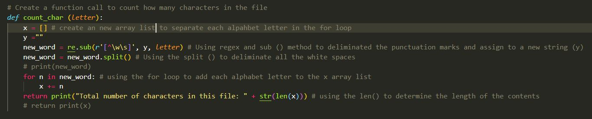

# Project Title

Challenge #2 - Word Count challenge

## Description

Prompt: Did you know you can access a word count feature on Google Docs by pressing Control + Shift + C 
We want you to re-implement word count, with a twist. Given a piece of text, return the following statistics:
### 1. Character Count
* Create a function call to count how many characters in the file

### 2. Word Count
* Create a function call to count how many words in the file

### 3. Sentence Count
* Create a function call to count how many sentence in the file

### 4. Paragraph Count
* Create a function call to count how many paragraph in the file


### 5. Bigrams (counts of unique pairs of words)
* Create a function call to count how many unique word in the file


### 6. Come up with your own features! Use this as an opportunity to show off! We’ll be impressed by creative, well-presented solutions.
* This function will replace all the "a" or "A" to "@" and all the "e" and "E" to "3"


## Getting Started

* Must have Python program install

### Installing

* Go to - https://github.com/dontu74/2.word-count

* Download 2 files from the above github link: challenge2.py and demo.txt

### Executing program

* Make sure the demo.txt is on the same directory as the challenge2.py
```
py .\challege2.py
```

## Authors

Contributors names and contact info

Don Tu
[@dontu - Github](https://github.com/dontu74)
[@dontu - replit](https://replit.com/@dontu74)


## Acknowledgments

### Learning Resources:
* [w3schools](https://www.w3schools.com/python/python_regex.asp#matchobject)
* [w3schools - Read Files](https://www.w3schools.com/python/python_file_open.asp)
* [Stackoverflow - Python users' forum](https://stackoverflow.com/questions/7359510/how-to-count-the-number-of-words-in-a-paragraph-and-exclude-some-words-from-a-f)
* [Geeksforgeeks - Python users' forum](https://www.geeksforgeeks.org/counting-number-lines-words-characters-paragraphs-text-file-using-java/)
* [freeCodeCamp - using set() to get unique values](https://www.freecodecamp.org/news/python-unique-list-how-to-get-all-the-unique-values-in-a-list-or-array/)
* [Corey Schafer - Youtube channel on Regex](https://www.youtube.com/watch?v=K8L6KVGG-7o)
